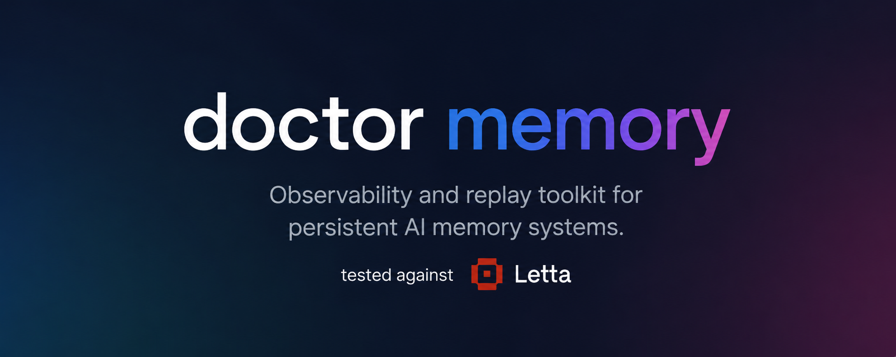

<h1 align="center">MemOps</h1>

<p align="center">
  Observability, replay, and regression analysis for persistent AI memory systems.
</p>

<p align="center">
  
  
  
  
  
</p>

<p align="center">
  
</p>

## What MemOps Is

MemOps is a Python-first developer tool for inspecting, measuring, and comparing the memory behavior of AI agents that persist information across sessions.

The product exists to answer a practical problem: once an agent has memory, it can fail in subtle ways that are hard to diagnose. It may retrieve nothing when it should remember, retrieve the wrong thing, rewrite memory too aggressively, carry stale facts forward, or become slow under memory pressure. Most teams can feel these problems during testing, but they lack a durable way to capture what happened, replay it, and compare one run against another.

MemOps is built to close that gap. It turns raw memory activity into a normalized event stream, stores it locally, reconstructs session history, computes memory-health metrics, and produces reports that make baseline-versus-candidate evaluation concrete.

## Why This Product Exists

Traditional observability stacks are strong at API latency, logs, and infrastructure health. They are weak at answering memory-specific questions for agent systems:

- Why did the agent miss a fact it should have known?
- Did retrieval quality get worse after a prompt or runtime change?
- Is the agent rewriting memory too often?
- Are memory recalls slow, empty, noisy, or stale?
- Did the latest candidate regress against the previous known-good behavior?

MemOps treats agent memory as a system that deserves the same rigor as any other production subsystem. The goal is not only to collect traces, but to make those traces actionable for debugging, evaluation, and release decisions.

## Product Goal

The long-term goal is to become a practical observability layer for persistent AI memory:

- capture memory activity from real agent frameworks
- normalize events into a framework-neutral schema
- replay memory evolution across a session
- score memory health with stable metrics
- compare baseline and candidate runs for regressions
- help developers explain why memory behavior changed

The current implementation is CLI-first and Letta-first by design. That keeps the product grounded in real workflows before expanding into broader adapters or a dedicated dashboard.

## Core Idea

MemOps sits between raw framework behavior and developer judgment.

Instead of relying on intuition like "this run felt worse," it gives you a repeatable pipeline:

1. Capture or ingest a real session trace.
2. Store the trace as normalized append-only memory events.
3. Reconstruct what the memory state looked like over time.
4. Compute memory-health metrics for the session.
5. Generate a report with threshold findings.
6. Compare two sessions to surface regressions.

This makes memory behavior testable in the same way teams already test latency, correctness, and reliability.

## How Memory Degradation Is Determined

MemOps does not decide that memory is degraded because one answer felt odd. It looks for measurable signs that the memory system is becoming unstable, inconsistent, ineffective, or slow.

The main parameters are:

- `memory_churn_rate`
  Too many writes or rewrites relative to total events. High churn often means unstable memory.
- `duplicate_rate`
  Repeated storage of the same fact or near-identical fact. This suggests noisy memory writing.
- `contradiction_score`
  Conflicting values for the same thing. This is one of the strongest poisoning or corruption signals.
- `stale_recall_rate`
  The agent keeps using outdated memory after newer information already exists.
- `empty_retrieval_rate`
  Retrieval happens, but useful memory does not come back.
- `retrieval_latency_ms_avg`
  Memory access becomes slower under pressure, often because retrieval quality or memory volume is getting worse.
- `retrieval_count`
  Helps judge whether the session actually exercised memory enough to trust the evaluation.
- `write_count`
  Raw memory mutation volume. Useful for understanding pressure and instability.
- `context_pressure_score`
  Indicates how much memory pressure is being pushed into the interaction.
- `memory_tokens_loaded_total`
  Measures how much memory payload is being dragged into the model.

In practice, memory degradation usually shows up as one or more of these patterns rising:

- instability
- inconsistency
- uselessness
- slowness

Single-session health is judged through configured thresholds. Baseline-versus-candidate health is judged through regression deltas. Together, those two views tell you whether the session stayed healthy, drifted, or became unsafe to trust.

## What The Dashboard Is For

The dashboard is meant to act like an observability layer for AI agents, not just a visual report.

It is designed to help a developer answer:

- when did the session first start degrading
- whether the issue looked like drift, poisoning, contradiction, stale recall, or retrieval failure
- which turn or replay step introduced the first suspicious change
- what sequence of writes and retrievals happened before the bad behavior appeared
- whether the issue looked session-local or systemic in the memory layer

The current dashboard focuses on:

- per-turn health timelines
- trend charts for key memory signals
- incident-style surfacing of threshold breaches and drift onset
- replay-backed event streams
- root-cause hints such as first degradation, first duplicate, first contradiction, and suspect recalls

## Who This Is For

- teams building agents with persistent memory
- developers evaluating retrieval quality across changes
- researchers testing memory behavior under stress
- anyone who needs more than transcripts to understand why an agent remembered, forgot, or slowed down

## What Exists Today

MemOps already has a real working core:

- normalized append-only memory events
- local trace storage and replay
- retrieval-path inspection
- health thresholds and regression checks
- baseline-versus-candidate comparison
- dashboard-based observability for live and stored sessions

It is already useful for:

- local agent memory debugging
- regression-oriented testing
- stress testing retrieval quality
- understanding where a persistent-memory agent first started going wrong

## Setup And Workflow Docs

The main README is intentionally product-facing.

For setup, CLI usage, capture workflows, testing procedures, and implementation history, use:

- [docs/roadmap.md](/home/kedar/Desktop/Projects/doctor%20memory/docs/roadmap.md)
- [docs/testing.md](/home/kedar/Desktop/Projects/doctor%20memory/docs/testing.md)
- [docs/versioning.md](/home/kedar/Desktop/Projects/doctor%20memory/docs/versioning.md)

Recommended local install:

```bash
uv pip install -e .
```

## Development Philosophy

MemOps is being built with a narrow, deliberate scope:

- Python-first
- framework-neutral at the core
- Letta-first as the initial adapter
- local and inspectable before distributed and abstract
- test-gated at every phase

The project treats testing as a product requirement, not a cleanup step. Manual and automated validation expectations live in `docs/testing.md`.

## Roadmap Status

The project has completed the first reporting-oriented milestone needed to make memory behavior measurable:

- Phase 1: core event model and local storage
- Phase 2: Letta adapter MVP and capture workflow
- Phase 3: metrics, health reports, and session comparison
- Phase 4: retrieval explainability and causal recall inspection
- Phase 5: replay engine, step inspection, and offline snapshot diffing
- Phase 6: alerts, regression checks, and CI hooks
- Phase 7: local dashboard foundation for memory observability
- Phase 8: AI agent observability layer for drift, poisoning, and root-cause debugging

For details, see:

- `docs/roadmap.md`
- `docs/testing.md`
- `docs/versioning.md`

## Current State

This is a real product direction with an early but functional implementation. It already supports practical memory-health debugging, replay, regression comparison, and dashboard-based observability for Letta-oriented workflows.

The broader vision is larger than the current codebase, but the core loop is already in place:

- capture agent memory behavior
- convert it into analyzable signals
- detect degradation
- surface first-cause clues
- help developers improve the agent or memory system
